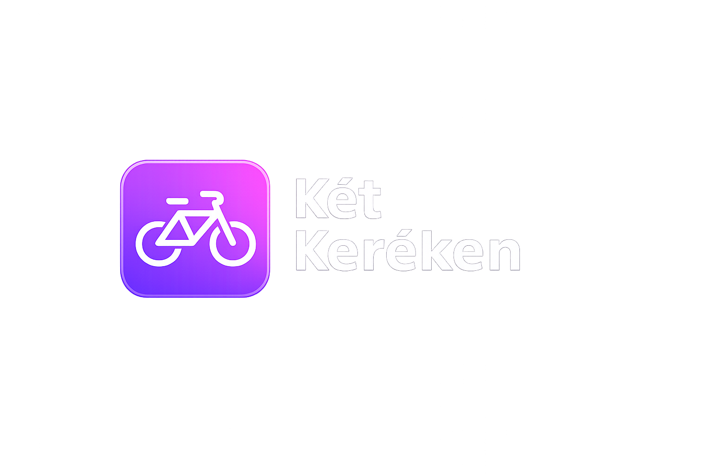

<div align="center">

# Két Keréken

### Kerékpáros útvonalak, helyek és események egy modern térképes platformon

<p align="center">
  
</p>

<p align="center">
  Egy térképalapú webalkalmazás, amely segít bringás útvonalak, érdekes helyek,
  események és kölcsönzők felfedezésében egy egységes, letisztult felületen.
</p>

<p align="center">
  <a href="#áttekintés">Áttekintés</a> •
  <a href="#fő-funkciók">Fő funkciók</a> •
  <a href="#képernyőképek">Képernyőképek</a> •
  <a href="#tech-stack">Tech stack</a> •
  <a href="#telepítés">Telepítés</a> •
  <a href="#projekt-struktúra">Projekt struktúra</a>
</p>

</div>

---

## Áttekintés

A **Két Keréken** egy interaktív, térképközpontú bringás webalkalmazás.  
A célja, hogy egy helyen lehessen átlátni és kezelni:

- **útvonalakat**
- **desztinációkat**
- **eseményeket**
- **kölcsönzőket**
- közösségi **képeket**
- felhasználói **értékeléseket**
- személyes **kedvenceket**

Az alkalmazás felhasználói és admin oldallal is rendelkezik, így nemcsak böngészésre, hanem tartalomkezelésre is alkalmas.

---

## Fő funkciók

### Interaktív térkép
- Leaflet alapú térképes megjelenítés
- különböző típusú markerek
- popup előnézetek
- útvonalak kirajzolása koordinátalistából
- kijelölés alapján részletes nézet megnyitása

### Útvonalak és helyek kezelése
- útvonalak hossz, nehézség és egyéb adatok alapján
- desztinációk és kölcsönzők térképes megjelenítése
- események megjelenítése időponthoz és helyhez kötve

### Felhasználói rendszer
- regisztráció és bejelentkezés
- JWT + cookie alapú auth
- profiloldal
- profilkép és bio kezelése

### Közösségi funkciók
- képfeltöltés
- értékelések írása
- kedvencek kezelése
- saját aktivitások megjelenítése a profilon

### Admin panel
- rekordok létrehozása, szerkesztése, törlése
- felhasználók kezelése
- értékelések és képek jóváhagyása / elutasítása
- státusz alapú moderáció

---

## Képernyőképek

### Főoldal
> Ide jön majd a főoldal screenshotja

```md

```

### Térkép nézet
> Ide jön majd a térkép screenshotja

```md

```

### Részletes panel
> Ide jön majd a részletes nézet screenshotja

```md

```

### Profil oldal
> Ide jön majd a profil screenshotja

```md

```

### Admin panel
> Ide jön majd az admin screenshotja

```md

```

---

## Tech stack

### Frontend
- React
- Vite
- React Leaflet
- Font Awesome
- CSS

### Backend
- Node.js
- Express

### Adatbázis
- MySQL

### Egyéb
- JWT
- Multer
- Cookie-based auth

---

## Telepítés

### 1. Adatbázis

Hozz létre egy MySQL adatbázist, majd importáld a projekt SQL fájlját.

Példa adatbázis név:

```sql
ketkereken
```

---

### 2. Backend telepítése

```bash
cd backend
npm install
```

#### `.env` példa

```env
PORT=3001
FRONTEND_ORIGIN=http://localhost:5173

JWT_SECRET=random_secret_string
TOKEN_TTL_DAYS=7
AUTH_COOKIE_NAME=kk_token

DB_HOST=localhost
DB_USER=root
DB_PASSWORD=your_password
DB_NAME=ketkereken
```

#### Backend indítása

```bash
npm run dev
```

A backend alapértelmezett címe:

```txt
http://localhost:3001
```

---

### 3. Frontend telepítése

```bash
npm install
npm run dev
```

A frontend alapértelmezett címe:

```txt
http://localhost:5173
```

---

## Jogosultságok

Az alkalmazás két alapvető szerepkört használ:

- `felhasznalo`
- `admin`

### Felhasználó
- böngészhet a térképen
- írhat értékelést
- tölthet fel képet
- kezelheti a kedvenceit
- szerkesztheti a saját profilját

### Admin
- hozzáfér az admin panelhez
- kezelheti az adatokat
- jóváhagyhatja vagy elutasíthatja a beküldött tartalmakat
- módosíthatja a felhasználók adatait

---

## Projekt struktúra

```bash
src/
  components/
  pages/
  styles/
  lib/

backend/
  server.js

uploads/
docs/
  screenshots/
  logo.png
```

Ha később modularizálva lesz a backend, akkor például így is kinézhet:

```bash
backend/
  src/
    controllers/
    routes/
    middleware/
    config/
    utils/
  server.js
```

---

## Fő oldalak

### `/`
A nyitóoldal, ahol az alkalmazás rövid bemutatása és előnézeti elemei jelennek meg.

### `/terkep`
A fő térképes felület, ahol a felhasználó böngészheti az útvonalakat, helyeket, eseményeket és kölcsönzőket.

### `/login`
Bejelentkezési oldal.

### `/register`
Regisztrációs oldal.

### `/u/:username`
Nyilvános vagy saját profiloldal.

### `/admin`
Admin felület a tartalmak kezelésére és moderálására.

---

## Fejlesztési ötletek

- részletesebb keresés és szűrés
- mobil felület további finomítása
- még több közösségi funkció
- térképes kedvencek nézet
- értesítések a jóváhagyásokról
- útvonalajánlás külső routing API-val

---

## Megjegyzések

- A frontend a backenddel `credentials: "include"` módban kommunikál.
- A hitelesítés cookie alapú JWT-vel történik.
- Az útvonalak JSON koordinátalistából épülnek fel.
- A közösségi tartalmak moderáció után jelennek meg nyilvánosan.

---

## Készítette

Ez a projekt vizsgaremek / portfólió célra készült, modern webes és térképes megoldások bemutatására.
