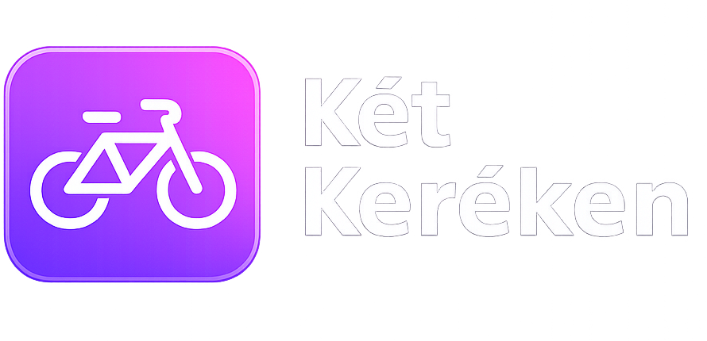
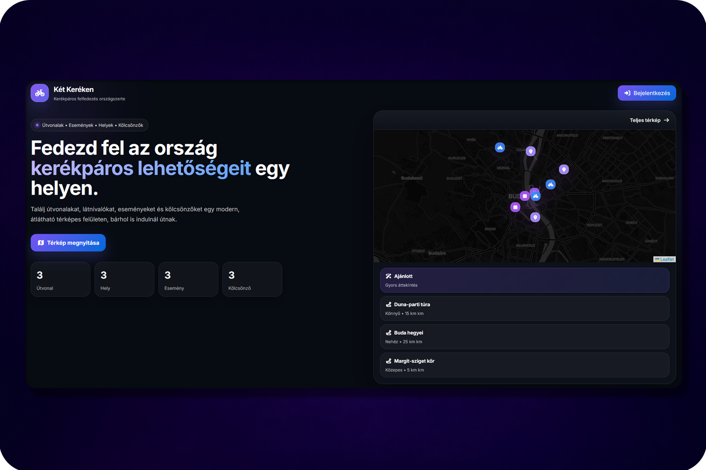

<div align="center">
<p align="center">
  
</p>
# Két Keréken

### Kerékpáros útvonalak, helyek és események egy modern térképes platformon

<p align="center">
  Egy térképalapú webalkalmazás, amely segít bringás útvonalak, érdekes helyek,
  események és kölcsönzők felfedezésében egy egységes, letisztult felületen.
</p>

<p align="center">
  <a href="#áttekintés">Áttekintés</a> •
  <a href="#fő-funkciók">Fő funkciók</a> •
  <a href="#képernyőképek">Képernyőképek</a> •
  <a href="#projekt-struktúra">Projekt struktúra</a>
</p>

</div>

---

## Áttekintés

A **Két Keréken** egy interaktív, térképközpontú bringás webalkalmazás.  
A célja, hogy egy helyen lehessen átlátni és kezelni:

- **útvonalakat**
- **desztinációkat**
- **eseményeket**
- **kölcsönzőket**
- közösségi **képeket**
- felhasználói **értékeléseket**
- személyes **kedvenceket**

Az alkalmazás felhasználói és admin oldallal is rendelkezik, így nemcsak böngészésre, hanem tartalomkezelésre is alkalmas.

---

## Fő funkciók

### Interaktív térkép
- Leaflet alapú térképes megjelenítés
- különböző típusú markerek
- popup előnézetek
- útvonalak kirajzolása koordinátalistából
- kijelölés alapján részletes nézet megnyitása

### Útvonalak és helyek kezelése
- útvonalak hossz, nehézség és egyéb adatok alapján
- desztinációk és kölcsönzők térképes megjelenítése
- események megjelenítése időponthoz és helyhez kötve

### Felhasználói rendszer
- regisztráció és bejelentkezés
- JWT + cookie alapú auth
- profiloldal
- profilkép és bio kezelése

### Közösségi funkciók
- képfeltöltés
- értékelések írása
- kedvencek kezelése
- saját aktivitások megjelenítése a profilon

### Admin panel
- rekordok létrehozása, szerkesztése, törlése
- felhasználók kezelése
- értékelések és képek jóváhagyása / elutasítása
- státusz alapú moderáció

---


## Munkamegosztás
### Srámli Dávid Bence

- az adatbázis létrehozása, módosítása és több verziójának kialakítása
- a backendhez kapcsolódó alapok és technikai struktúrák kialakítása
- az admin felület egyes részeinek elkészítése
- a bejelentkezési felület és az adminpanel korai verzióinak kidolgozása
- loading screen és 404-es oldal elkészítése
- hibajavítások és technikai finomhangolások
- projektmappák átszervezése és szerkezeti módosítások
- dokumentáció és README egyes részeinek frissítése
- merge-ek és különböző fejlesztési részek összevezetése

### Hermann Zsombor

- az aktivitásokhoz kapcsolódó funkciók fejlesztése
- a követési rendszer kialakítása
- a főoldal és a térképes megjelenítés vizuális átdolgozása
- a design és a felhasználói felület több elemének továbbfejlesztése
- onboarding és auth felületek egyes újratervezései
- értékelésekhez és kedvelésekhez kapcsolódó backend funkciók megvalósítása
- kisebb hibák javítása
- dokumentációs és README módosítások
- egyes fejlesztési részek összevonása és rendszerezése

### Közös munka

- az alkalmazás alapötlete és felépítése
- a funkciók megtervezése
- az oldalak szerkezetének kialakítása
- a felhasználói élmény javítását szolgáló döntések
- az egyes frontend és backend részek összehangolása

---

## Képernyőképek

### Főoldal



### Térkép nézet

```md

```

### Részletes panel

```md

```

### Profil oldal

```md

```

### Admin panel

```md

```

---

### Frontend
- React
- Vite
- React Leaflet
- Font Awesome
- CSS

### Backend
- Node.js
- Express

### Adatbázis
- MySQL

### Egyéb
- JWT
- Multer
- Cookie-based auth

---

## Jogosultságok

Az alkalmazás két alapvető szerepkört használ:

- `felhasznalo`
- `admin`

### Felhasználó
- böngészhet a térképen
- írhat értékelést
- tölthet fel képet
- kezelheti a kedvenceit
- szerkesztheti a saját profilját

### Admin
- hozzáfér az admin panelhez
- kezelheti az adatokat
- jóváhagyhatja vagy elutasíthatja a beküldött tartalmakat
- módosíthatja a felhasználók adatait

---

## Projekt struktúra

```bash
src/
  components/
  pages/
  styles/
  lib/

backend/
  src/
    controllers/
    routes/
    middleware/
    config/
    utils/
  server.js

uploads/
docs/
  screenshots/
  logo.png
```

---

## Fő oldalak

### `/`
A nyitóoldal, ahol az alkalmazás rövid bemutatása és előnézeti elemei jelennek meg.

### `/terkep`
A fő térképes felület, ahol a felhasználó böngészheti az útvonalakat, helyeket, eseményeket és kölcsönzőket.

### `/login`
Bejelentkezési oldal.

### `/register`
Regisztrációs oldal.

### `/u/:username`
Nyilvános vagy saját profiloldal.

### `/admin`
Admin felület a tartalmak kezelésére és moderálására.

---

## Készítette

Ez a projekt vizsgaremek / portfólió célra készült, Srámli Dávid Bence és Hermann Zsombor által.
